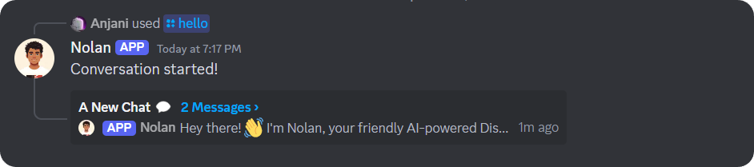

AI-powered discord chat-bot works with the help of LLMs such as ChatGPT and Gemini (Google's generative AI model), and with features that no other chat-bot provides.

> 
> Preview of `/hello` command.

## 🌴 Features
- 💫 **Actions**, you can make the bot do things while chatting such as playing rock paper scissor by just saying agout it.
- 🧠 **Coding Knowledge**, our AI-models are trained on large database of codes to gain knowledge about popular libraries and packages.
- 🔒 **Private Conversations**, you can chat with Nolan even in Private Messages (DMs).
- 🔐 **Security**, our discord bot 'Nolan' guarantees that 'No data is sent to any third-party else the LLMs (Gemini/ChatGPT), none of your data is stored in our databases. Some of the `setups` (Setups are the channel those admins can setup to make the Nolan, auto-reply in them.) and `conversations` (Conversations refer to the talk you do with Nolan using `/hello` command commonly.) and the **messages** you sent in them for giving a clear context to our AI models that what's happening in the chat are stored at our database.
